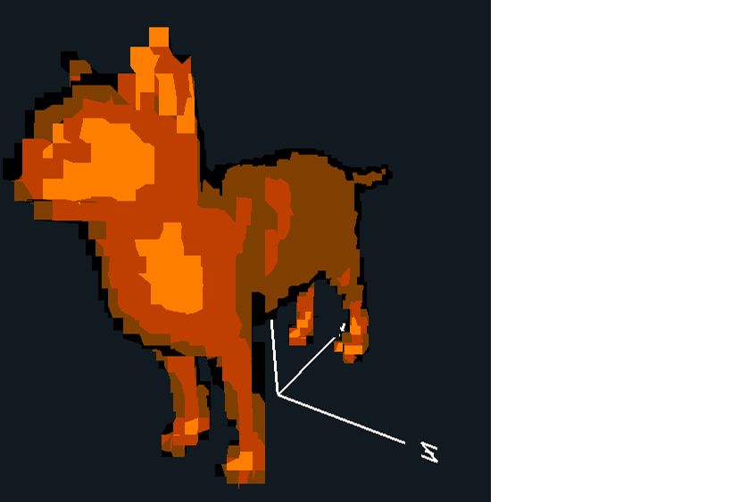

# Pixel Art Shader

This project is a custom GLSL shader written for a class project, designed to create a pixel art shader using stylized, toon-like rendering effect with hard shading bands, pixelation, pasteurization, and edge outlining. It was written in OpenGL using GLSL 330 compatibility.

https://youtu.be/-vvQiV4wTRM

## Features

- **Cel Shading (Toon Shading):** Creates hard lighting bands instead of smooth gradients.
- **Edge Outlining:** Detects object edges using normal variation and draws black outlines.
- **Pasteurization:** Reduces color depth for a stylized, poster-like look.
- **Pixelation (Vertex-level):** Snaps geometry to a virtual pixel grid for a retro pixel-art aesthetic.

## Shader Overview

### `final.frag`
Handles fragment-level coloring:

- Applies cel shading using dot product intensity between light and normal.
- Adds edge outlines based on the screen-space derivative (`fwidth`) of the normal.
- Combines colors and applies pasteurization by reducing the number of RGB color levels.

### `final.vert`
Handles vertex-level transformations:

- Snaps geometry to a grid using a `uPixelSize` uniform for pixelation.
- Calculates normals, view direction, and lighting vectors for interpolation.

## Screenshots

|  | 

## Requirements

- OpenGL 3.3+ (or 1.20 for Mac)
- GLSL compatible renderer

## Educational Purpose

This shader was developed as a project for my Computer Graphics class. The goal was to simulate the appearance of 3D pixel art with an expressive, stylized look.

---

> Watch the full demo here:

